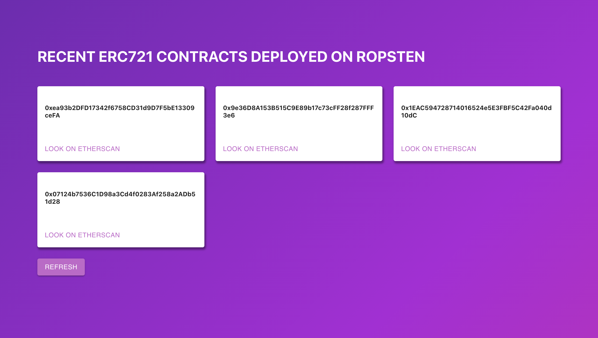

# ERC721 Scanner Test Project
This is a test project that scans the Ropsten network for ERC721 contract deployments 
in the last 15 minutes. 


## Backend
To run the backend, run the following:
```
cd backend
npm install
npm start
```
It checks for ERC721s by checking if they implement the right ERC165 hash.

## Frontend
To run the frontend, run the following:
```
cd frontend
npm install
npm start
```